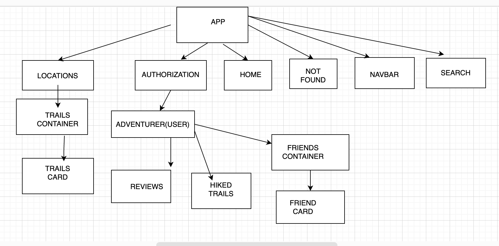
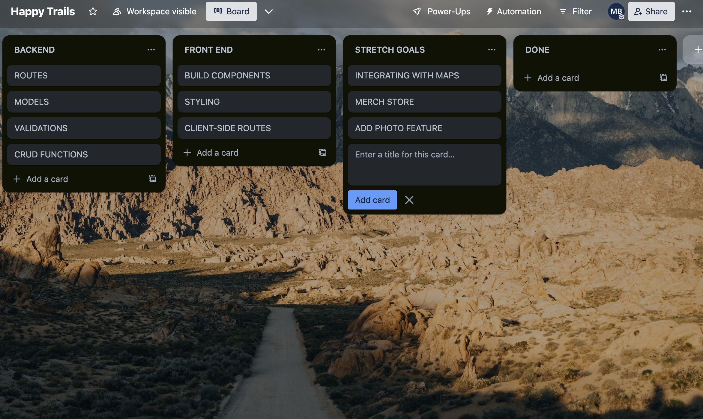

# HappyTrails - Find a Friend. Take a Hike. 

## User Stories:
- Users can search for trails to hike based on location and user preferences.
- User can rate trails they have hiked.
- User can view previous trails and ratings.
- Trails are suggested to User based on history, preferences and ratings/reviews from friends.
- Find new hiking friends based on location and preferences. 
- View information about each trail

## Wireframe
https://www.figma.com/file/7zUR0oTTuSDc9zeY66zNAW/Happy-Trails-team-library?type=design&node-id=0%3A1&mode=design&t=slX3AmVv58niUTyR-1

## Schema

## API Routes
| API Route                | Method | Body                                                                                   | Response                                                                                                                                                          |
|--------------------------|--------|----------------------------------------------------------------------------------------|-------------------------------------------------------------------------------------------------------------------------------------------------------------------|
| /adventurers             | GET    |                                                                                        | { "id": 1, "name": "Val", "email": "val@awesome.com", "username": "valCal", "password": ****** }, {..}, {..},...                                                  |
| /adventurers             | POST   | { "name": "data", "username": "data", "email": "data@email.com"' "password": "*****" } | { "name": "data", "username": "data", "email": "data@email.com"' "password": "*****" }                                                                            |
| /adventurers/<int:id>    | GET    |                                                                                        | { "id": 1, "name": "Val", "email": "val@awesome.com", "username": "valCal", "password": "******"  }                                                               |
| /adventurers/<int:id>    | PATCH  | { "attr":"data"}                                                                       | { "id": 1, "name": "Val", "email": "val@awesome.com", "username": "UpdatedvalCal", "password": "******"  }                                                        |
| /adventurers/<int:id>    | DELETE |                                                                                        | {}                                                                                                                                                                |
| /trails                  | GET    |                                                                                        | {     "id" : 2,     "name" : "trail name",     "difficulty" : 5,     "distance" : 2,     "altitude" : 5280,     "description" : "trail description" }, {..}, {..} |
| /trails/<int:id>         | GET    |                                                                                        | {     "id" : 2,     "name" : "trail name",     "difficulty" : 5,     "distance" : 2,     "altitude" : 5280,     "description" : "trail description" }             |
| /hiked_trails            | GET    |                                                                                        | {     "id" : 2,     "date" : 06-23-2023,     "adventurer_id" : 1,     "trail_id" : 2 }, {..}, {..},...                                                            |
| /hiked_trails/<int:id>   | GET    |                                                                                        | {     "id" : 2,     "date" : 06-23-2023,     "adventurer_id" : 1,     "trail_id" : 2 }                                                                            |
| /hiked_trails/<int:id>   | DELETE |                                                                                        | {}                                                                                                                                                                |
| /trail_reviews           | GET    |                                                                                        | {     "id" : 1,     "review" : "review here",     "adventurer_id" : 2 }, {..}, {..}, ..                                                                           |
| /trail_reviews           | POST   | {     "review" : "review here",     "adventurer_id" : 2, "rating":4  }                 | {     "review" : "review here",     "adventurer_id" : 2, "rating":4  }                                                                                            |
| /trail_reviews/<int:id>  | GET    |                                                                                        | {     "id" : 1,     "review" : "review here",     "adventurer_id" : 2 }                                                                                           |
| /trail_reviews/<int:id>  | PATCH  | { "attr" : "data",     "adventurer_id" : 3 }                                           | { "attr" : "data",     "adventurer_id" : 3 }                                                                                                                      |
| /trail_reviews/<int:id>  | DELETE |                                                                                        | {}                                                                                                                                                                |
| /friends                 | GET    |                                                                                        | {     "id" : 5,     "name" : "Beau" }, {..}, {..}, ...                                                                                                            |
| /friends/<int:id>        | GET    |                                                                                        | {     "id" : 5,     "name" : "Beau" }                                                                                                                             |
| /friends/<int:id>        | DELETE |                                                                                        | {}                                                                                                                                                                |
|/login | POST | {"name":"Val", "password": "******"} |  |
|/authorize_session | GET | | |

## React Component Tree

## Client-side Routes
| Client Route   | Component     |
|----------------|---------------|
| /home              | TrailList.js        |
| /trails        | TrailList.js  |
| /hiked_trails      | HikedTrailList.js  |
| /trail_reviews | AddReview.js  |
| /signup    | SignupForm.js  |
| /safety        | Safety.js     |
| /login         | LoginForm.js  |

## Trello Board

